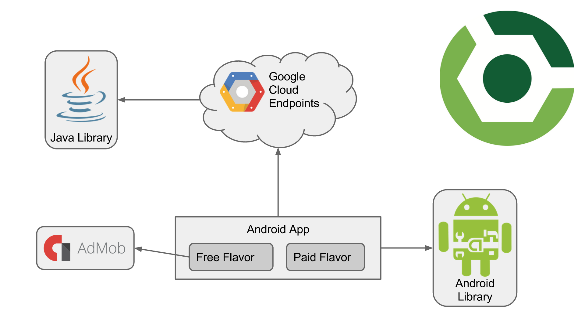
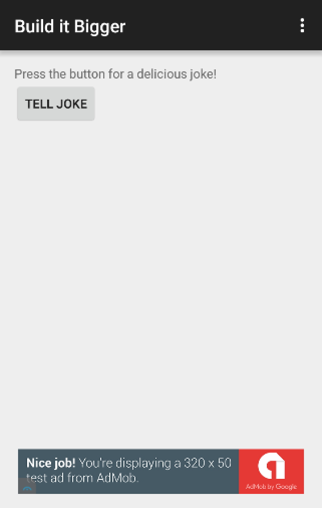
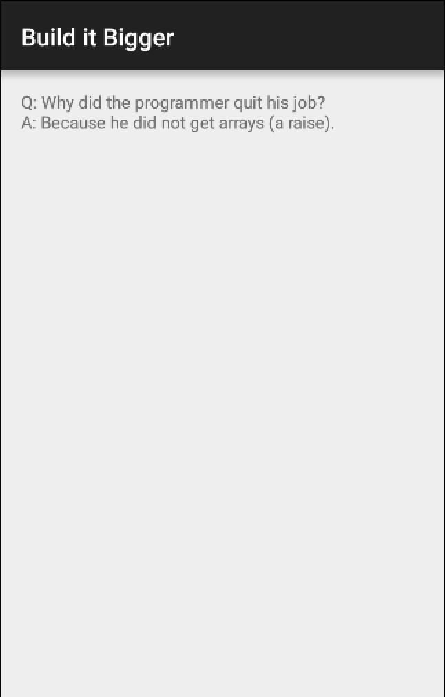

# Build it Bigger
This project is part of Udacity Nanodegree. This project creates an app with multiple flavors that uses multiple libraries and Google Cloud Endpoints. This app consists of four modules:
	1.	A Java library that provides jokes
	2.	A Google Cloud Endpoints (GCE) project that serves those jokes
	3.	An Android Library containing an activity for displaying jokes
	4.	An Android app that fetches jokes from the GCE module and passes them to the Android Library for display

It customizes the behavior of the Gradle build tool, allowing automation of repetitive tasks. Particularly, factoring functionality into libraries and creating product flavors allowing for much bigger projects with minimal added complexity.

## Learning keys on this project:
* The role of Gradle in building Android Apps and how to use Gradle to manage apps of increasing complexity.
* Add free and paid flavors to an app, and set up your build to share code between them
* Factor reusable functionality into a Java library
* Factor reusable Android functionality into an Android library
* Configure a multi-project build to compile your libraries and app
* Use the Gradle App Engine plugin to deploy a backend
* Configure an integration test suite that runs against the local App Engine development server

## Project structure

## Install
1. Install Android Studio, make sure that the Android SDK Tools are properly installed.
2. Download or clone this repository and import it into Android Studio. 
3. Compile and run `backend` project.
4. Compile and run `app` project in emulator.

## Screenshots

## License
The content of this repository is licensed under a [Apache License, Version 2.0](http://www.apache.org/licenses/LICENSE-2.0)
